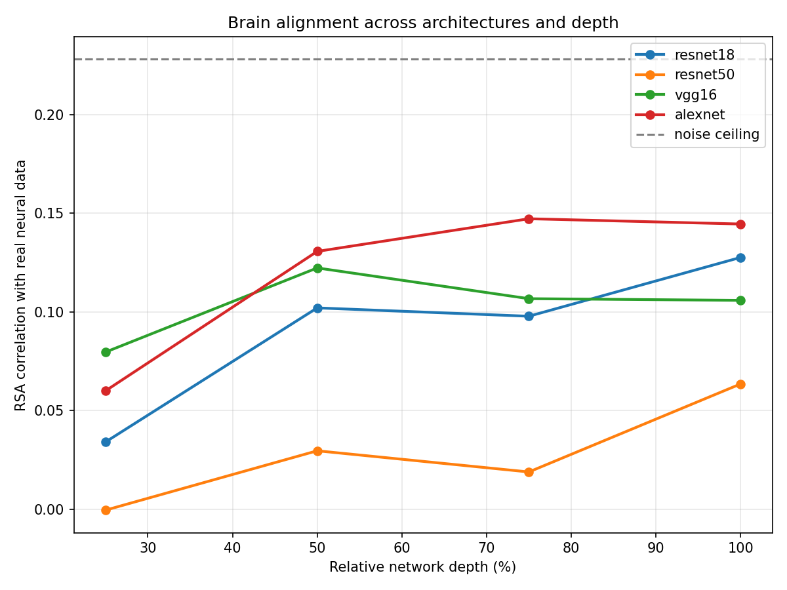
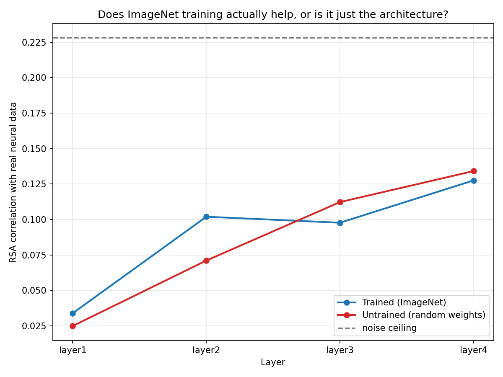
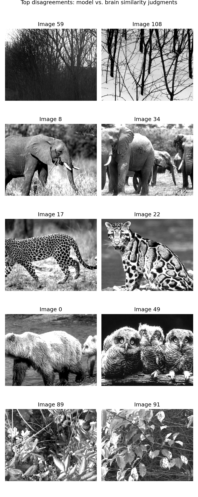

# Does a trained neural network "see" like a mouse's visual cortex?

A small, self-directed project comparing a pretrained CNN's internal representations to real neural recordings from mouse primary visual cortex (VISp), using Representational Similarity Analysis (RSA).

## Motivation

Convolutional neural networks trained on image classification were never designed to model biological vision — but their internal layers have been shown, in prior work, to partially resemble the visual cortex's own representations. This project asks three concrete questions:

1. How closely does a standard pretrained CNN's internal activity resemble real mouse VISp activity, for the same set of images?
2. Where does the resemblance break down, and does that breakdown follow an interpretable pattern?
3. Is the resemblance actually caused by training on ImageNet — or would an untrained, randomly-initialized network of the same architecture do just as well?

## Data

- **Neural data:** Allen Brain Observatory (Allen Institute) — two-photon calcium imaging responses from mouse VISp to a fixed set of natural scene images, publicly available via `allensdk`.
- **Model data:** activations extracted from pretrained torchvision models (ResNet-18, ResNet-50, VGG16, AlexNet) run on the identical natural scene images.

## Method

1. Averaged each neuron's response to each image across repeated presentations.
2. Built a Representational Dissimilarity Matrix (RDM) from the neural data — a table of "how differently did the population of neurons respond to every pair of images."
3. Built a matching RDM from each model layer's activations (average-pooled per channel).
4. Compared neural and model RDMs via Spearman correlation (standard RSA) across the upper triangle of each matrix.
5. Estimated a **noise ceiling** via split-half reliability of the neural data, to properly scale what correlation values actually mean, given inherent recording noise.
6. Identified the specific image pairs with the largest brain-model disagreement (z-scored gap between the two RDMs) and inspected them qualitatively.
7. Repeated the RSA comparison across 4 architectures, at ~4 relative depths each.
8. Ran a training-ablation control: same architecture (ResNet-18), random (untrained) weights vs. ImageNet-trained weights.

## Results

**1. Brain-alignment relative to noise ceiling (noise ceiling = 0.228)**

| Model | Best layer | RSA correlation | % of ceiling |
|---|---|---|---|
| AlexNet | stage3 | 0.147 | ~64% |
| ResNet-18 | layer4 | 0.128 | ~56% |
| VGG16 | block2 | 0.122 | ~54% |
| ResNet-50 | layer4 | 0.063 | ~28% |

### Brain-alignment across architectures and depth


Older, smaller, less accurate-at-classification architectures aligned *better* with mouse VISp than newer, larger, more accurate ones. Classification performance and brain-alignment are not the same axis, and can trade off.

**2. Where the model and brain disagree**

The largest model-brain disagreements were consistently same-category image pairs (two elephant photos, two big-cat photos, two tree/branch photos) that the model treats as similar but the brain does not, differing in pose, lighting, and exact texture. This suggests the model has learned an invariance to exactly the variation the brain still encodes — a direct consequence of training for category-level classification.

### Training vs. architecture control


**3. Training vs. architecture (untrained-network control)**

| Layer | Trained (ImageNet) | Untrained (random weights) |
|---|---|---|
| layer1 | 0.034 | 0.025 |
| layer2 | 0.102 | 0.071 |
| layer3 | 0.098 | 0.112 |
| layer4 | 0.128 | 0.134 |

### Where the model and brain disagree


At the deepest layers, an untrained, randomly-initialized network matched or slightly exceeded the trained network's brain-alignment. Training provided a modest early-layer benefit but essentially no advantage — and possibly a small cost — at greater depth. This is consistent with convolutional architecture alone (independent of learning) producing filters that resemble low/mid-level visual statistics, while ImageNet training pushes representations toward category-invariance that moves them further from what VISp appears to encode.


## Interpretation

A consistent story emerges across all three analyses: mouse VISp appears to represent low- and mid-level visual statistics (edges, texture, spatial frequency), which convolutional architecture captures largely "for free," independent of training. ImageNet training's main effect — learning category-invariant representations — is specifically the property that diverges most from what this brain area encodes. Bigger, more accurate, more invariant models are, if anything, further from biological alignment on this measure, not closer.

## Limitations

- Single brain area (VISp), single imaging session, single mouse — not yet checked for replication across sessions/animals.
- Response window (15 frames) and averaging approach are simplified relative to more careful published methodologies (e.g. full Brain-Score pipelines).
- Only 4 architectures and 4 relative-depth points per architecture; a denser or wider architecture sweep could sharpen the depth/training conclusions.
- RSA is one of several possible brain-model comparison metrics (vs. e.g. voxel/neuron-wise encoding models); results may not generalize to other metrics.

## Repo structure

```
stage1_get_data.py            # pull Allen Brain Observatory data
stage2_extract_activations.py # extract ResNet-18 activations
stage3_rsa.py                 # core RSA comparison, single model
noise_ceiling.py              # split-half reliability estimate
stage4_disagreements.py       # find & visualize top mismatched image pairs
stage4b_more_pairs.py         # additional disagreement pairs
stage3b_multi_model.py        # compare 4 architectures
stage3d_random_baseline.py    # trained vs. untrained control
visualize_progress.py         # sanity-check plots
```

## Next steps

- Replicate on additional Allen Brain Observatory sessions/mice to check robustness.
- Extend the architecture sweep (e.g. vision transformers, self-supervised models like DINO) to see whether the training-vs-architecture pattern holds beyond standard supervised CNNs.
- Move from RSA to a full encoding-model comparison (predicting individual neuron responses directly) for a stronger, more standard benchmark against the Brain-Score literature.
